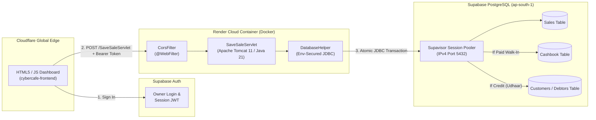

# 💻 Cyber Cafe Management System (Cloud-Native Edition)

A full-stack, double-entry accounting and debtor-tracking application built for cyber cafe operations. Migrated from a legacy local setup to a decoupled, cloud-native architecture using **Java 21 (Jakarta Servlet / Tomcat 11)**, **Docker**, **Supabase PostgreSQL**, **Render**, and **Cloudflare**.

## 🌐 Live Demo & Endpoints

* **Frontend Application (Cloudflare):** [https://cybercafe-frontend.bikash-shaw-dev01.workers.dev](https://cybercafe-frontend.bikash-shaw-dev01.workers.dev)
* **Backend API Health Check (Render):** [https://cybercafe-management-system.onrender.com/SaveSaleServlet](https://cybercafe-management-system.onrender.com/SaveSaleServlet)

---

## 🏗️ Cloud System Architecture

---

## ✨ Key Engineering Features

* **Automated Double-Entry Accounting:** Every transaction runs inside an atomic SQL transaction (`conn.setAutoCommit(false)`) with automatic `conn.rollback()` protection so accounts never fall out of balance.
    * **Paid Walk-in Sales:** Credits revenue to `Sales` and debits `Cash in Hand` or `Bank` in the `Cashbook` table.
    * **Credit (Udhaar) Sales:** Automatically locates or creates a customer profile in `Customers`, credits `Sales` as `Unpaid`, and increments the customer's outstanding debtor balance.
* **Zero-Credential Source Code:** Database credentials are never hardcoded; JDBC connections are injected at runtime via the `SUPABASE_DB_URL` environment variable.
* **Multi-Stage Docker Builds:** Compiles the `.war` artifact using `maven:3.9-eclipse-temurin-21` and deploys into a lightweight `tomcat:11.0-jdk21-temurin` production container.
* **Owner-Only Access:** Protected by **Supabase Authentication** so only the cyber cafe administrator can record ledger entries.

---

## 🛠️ Tech Stack

| Layer | Technology |
| :--- | :--- |
| **Frontend** | HTML5, CSS3, Vanilla JavaScript (`fetch` API), Supabase JS SDK |
| **Backend** | Java 21, Jakarta EE 10 Servlets, Apache Tomcat 11.0.26, Maven |
| **Database** | Supabase Cloud PostgreSQL (Session Pooler, Row-Level Security enabled) |
| **DevOps & Hosting** | Docker (Multi-Stage), Render (Backend Container), Cloudflare (Edge Frontend) |

---

## 🚀 Project Milestones

* **Milestone 1 (`v1.0`):** Core double-entry accounting engine (`SaveSaleServlet`, `CustomerManager`) and relational schema (`Sales`, `Cashbook`, `Customers`).
* **Milestone 2 (`v2.0`):** Migrated local SQL database to Supabase PostgreSQL (`ap-south-1`) with environment-variable JDBC security.
* **Milestone 3 (`v2.5`):** Containerized application with multi-stage `Dockerfile` and deployed web service to Render.
* **Milestone 4 (`v3.0-cloud-frontend`):** Decoupled frontend to Cloudflare with cross-origin (`CorsFilter`) JSON communication.
* **Milestone 5 (`v4.0-release`):** Integrated Supabase Owner Authentication and architecture documentation.